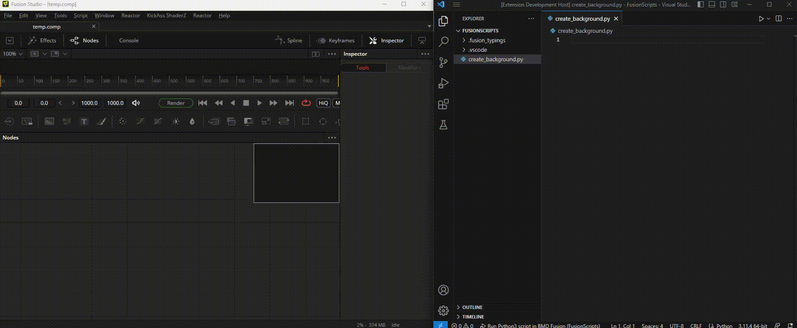
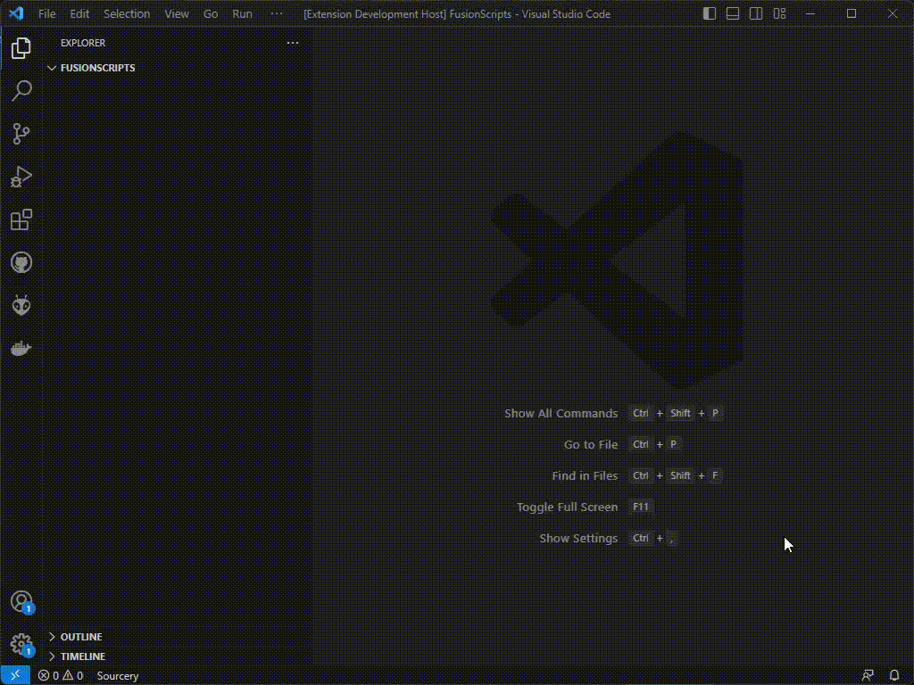
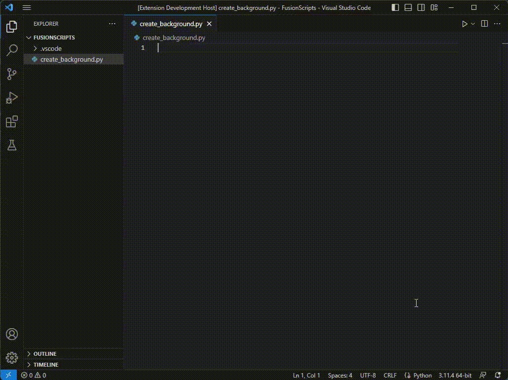

# BMD Fusion scripting extension for VSCode

Helps you setup your workspace to work as flawlessly as possible when scripting for BMD Fusion.

## Features

* Generate launch.json configs for your Fusion instance
  * Custom filepaths
  * Custom host
  * Lua and Python
  * Custom name
* Add python stubs for Fusions python API to get IntelliSense support. 
* Execute scripts directly from VSCode

## Generate launch configs

Quicky setup launch configs for your workspace to launch your Fusion scripts directly from VSCode to your wanted Fusion host

## Add python stubs for Fusions python API

Add fusion stubs for your workspace to get IntelliSense code suggestions directly in VSCode!

## Execute scripts directly from VSCode

With everything installed you can now quick and easy do scripting for Fusion!

**Enjoy!**
